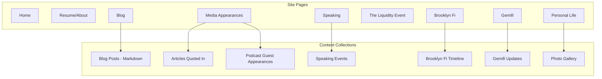

# Personal Brand Website for GitHub Pages

## Technology Choice: Astro

I recommend **Astro** for this project because:

- Native markdown support for blogging (write posts in `.md` files)
- Zero JS by default = fast page loads
- Component islands for interactivity where needed
- Excellent GitHub Pages deployment via GitHub Actions
- Easy YouTube/Vimeo embeds
- Content collections for structured data (blog posts, media appearances, etc.)

---

## Site Architecture



---

## Page Structure

### 1. Home

- Hero section with your name and tagline
- Quick navigation cards to main sections
- Featured/recent content highlights

### 2. Resume/About (Quirky Presentation)

- Interactive timeline or card-based layout instead of traditional resume
- Animated skill visualizations
- Downloadable PDF option

### 3. Blog

- Markdown-based posts with frontmatter for metadata
- Tags/categories for filtering
- Reading time estimates

### 4. Speaking

- Speaking bio and topics
- Embedded videos from YouTube/Vimeo (recommendation: **upload to YouTube** - it's free, handles all formats, and embeds beautifully)
- Upcoming/past events list

### 5. Media Appearances

- Two sections: Articles Quoted In + Podcast Guest Appearances
- Card grid with publication logos, dates, and links

### 6. The Liquidity Event Podcast

- Embedded YouTube playlist from your existing channel
- Episode highlights or descriptions

### 7. Brooklyn Fi Page

- Custom styling pulling from brooklynfi.com brand colors
- Timeline component showing 8-year journey (Founder to Board Member)
- Key contributions and milestones

### 8. Gemifi Page  

- Custom styling using gemifi.co brand colors
- Product history timeline
- Development updates section (mini-blog format)

### 9. Personal Life

- Photo gallery with lightbox viewer
- Sections for: Dog, Mexico City home, Sailing adventures
- Casual, warm tone

---

## Design Direction: Minimal Elegance

**Typography**: Distinctive serif/sans-serif pairing (e.g., Playfair Display for headings + Source Sans Pro for body, or similar refined combination)**Color Palette**:

- Primary: Deep charcoal or navy base
- Accent: One signature color (gold, terracotta, or sage)
- Plenty of whitespace

**Subtle Flair**:

- Smooth page transitions
- Hover micro-interactions
- Understated scroll animations
- Custom cursor or link hover effects

**Brand Integration**:

- Brooklyn Fi page: Import their brand colors as CSS variables
- Gemifi page: Import their brand colors as CSS variables
- Both pages feel cohesive with main site but carry their brand identity

---

## Video Hosting Recommendation

**Use YouTube** for all video content (speaking recordings, etc.):

- Zero hosting costs
- Handles transcoding automatically
- Built-in analytics
- SEO benefits
- One-line embed code
- You already have a channel for The Liquidity Event

Simply upload speaking videos as unlisted (if you want privacy) or public, then embed on your site.---

## Project Structure

```javascript
/
├── src/
│   ├── pages/
│   │   ├── index.astro (Home)
│   │   ├── about.astro (Resume)
│   │   ├── blog/
│   │   ├── speaking.astro
│   │   ├── media.astro
│   │   ├── podcast.astro
│   │   ├── brooklyn-fi.astro
│   │   ├── gemifi.astro
│   │   └── personal.astro
│   ├── content/
│   │   ├── blog/ (markdown posts)
│   │   ├── speaking/ (event data)
│   │   ├── media/ (appearances data)
│   │   └── gallery/ (photo metadata)
│   ├── components/
│   │   ├── Header.astro
│   │   ├── Footer.astro
│   │   ├── Timeline.astro
│   │   ├── VideoEmbed.astro
│   │   ├── PhotoGallery.astro
│   │   └── ...
│   ├── layouts/
│   │   ├── BaseLayout.astro
│   │   ├── BlogLayout.astro
│   │   ├── BrooklynFiLayout.astro
│   │   └── GemifiLayout.astro
│   └── styles/
│       ├── global.css
│       ├── brooklyn-fi.css
│       └── gemifi.css
├── public/
│   └── images/
├── astro.config.mjs
└── package.json
```

---

## Deployment

GitHub Actions workflow for automatic deployment:

1. Push to `main` branch
2. Astro builds static site
3. Deploys to `gh-pages` branch
4. Live at `yourusername.github.io` (or custom domain)

---

## Next Steps After Approval

1. Initialize Astro project with TypeScript
2. Set up base layout and navigation
3. Implement home page with hero and section previews
4. Build out each page with placeholder content
5. Create content collection schemas for blog, media, etc.
6. Add styling and animations
7. Configure GitHub Actions deployment
8. Add sample content for all sections

---

## Content You'll Need to Provide

- Resume details for the quirky presentation
- Blog post drafts (or we start with placeholders)
- List of articles you've been quoted in
- List of podcasts you've guested on
- Speaking topics and any existing recordings